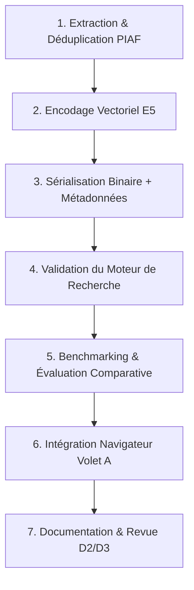

# Plan d'Action — Domaine 4 -  Encodage Vectoriel et Indexation sur Corpus Réduit (PIAF)

**Projet de module NLP 2 — Master 2 Data & IA — FGES, Université Catholique de Lille**
**Équipe Data Tigers** • **Domaine D2 : Encodeur et Index**
**Responsable principal :** Remy RAYANE • **Soutien :** Mahé BEGNIS
**Cadre :** Résolution de l'[Issue #30](https://github.com/datatigersNLP/data_tigers_nlp/issues/30) • Milestone **Mi-parcours (01/10/2026)**
**Jeu de données de référence :** [`AgentPublic/piaf`](https://huggingface.co/datasets/AgentPublic/piaf)

---

## 1. Cadrage et Objectifs Opérationnels

### 1.1 Contexte et Enjeux de l'Issue #30

L'objectif de l'Issue #30 est de construire et valider le premier pipeline complet d'encodage dense et d'indexation vectorielle sur un **corpus réduit et contrôlé**.

Ce travail constitue la clé de voûte commune aux deux axes du projet :

1. **Volet A (Application Web en ligne) :** L'index précalculé sera embarqué côté client pour permettre une recherche sémantique en corpus fermé (Cas A3) sans backend, exécutée par `Transformers.js` / ONNX Runtime Web dans le navigateur.
2. **Volet B (Application Locale RAG) :** L'index et le modèle d'encodage alimenteront le retriever du système RAG sourcé avec abstention (Cas B1) couplé à `Qwen2.5-7B-Instruct`.

### 1.2 Pourquoi le jeu de données PIAF comme corpus réduit ?

Le jeu de données [`AgentPublic/piaf`](https://huggingface.co/datasets/AgentPublic/piaf) (développé par Etalab / AgentPublic) est un dataset francophone natif de Question-Answering sous licence MIT. Il présente des propriétés idéales pour calibrer et valider notre architecture :

- **Vérité terrain humaine (*Ground Truth*) :** Contrairement à un corpus brut non annoté, PIAF associe chaque question à son passage contextuel exact (`context`). Nous disposons ainsi immédiatement d'un banc de test objectif sans biais de génération synthétique.
- **Volumétrie maîtrisée :**
  - **3 835** paires question-réponse,
  - **761** contextes textuels uniques (paragraphes Wikipédia francophones),
  - **191** articles Wikipédia distincts (`title`),
  - Longueur moyenne par contexte : **688,4 caractères** (~111 mots, soit environ 130 à 150 subwords/tokens).
- **Contrôle de conformité réseau :** L'indexation de 761 passages en dimension 384 pèse **1,17 Mio** en Float32 (et **~293 Kio** en quantification Int8). C'est le format parfait pour valider la faisabilité du Volet A sans saturer la bande passante ni la mémoire du navigateur.

---

## 2. Spécifications Techniques et Fondements NLP

### 2.1 Modèle d'Embeddings Retenu

Conformément à l'arbitrage rendu dans l'Issue #4 et consigné au jalon J2 :

- **Modèle :** `Xenova/multilingual-e5-small` (version ONNX / Transformers.js dérivée d'`intfloat/multilingual-e5-small`).
- **Architecture :** Transformer basé sur XLM-RoBERTa (117,7 millions de paramètres).
- **Dimensionnalité de sortie :** $d = 384$.
- **Longueur maximale de séquence ($L_{max}$) :** 512 tokens.

### 2.2 Règle d'Or NLP : Asymétrie des Préfixes E5

Les modèles de la famille **E5** (*EmbEddings from bidirEctional Encoder representationS*) sont entraînés avec un contraste asymétrique entre requêtes et passages. Pour obtenir une similarité sémantique optimale, les entrées **doivent impérativement** être préfixées :

- **À l'indexation des passages :** préfixe `"passage: "`
  $$
  \mathbf{p}_{raw} = \text{"passage: "} + \text{context}
  $$
- **À l'inférence des requêtes :** préfixe `"query: "`
  $$
  \mathbf{q}_{raw} = \text{"query: "} + \text{question}
  $$

> **Point de vigilance :** L'omission de ce préfixe entraîne une chute documentée de 10 à 25 % du Recall@k sur les benchmarks de recherche documentaire (BEIR/MTEB).

### 2.3 Pooling et Normalisation Euclidienne ($L_2$)

L'encodeur extrait un tenseur tridimensionnel $(\text{batch\_size}, \text{seq\_len}, 384)$. L'embedding final est obtenu par :

1. **Mean Pooling pondéré :** Moyenne des représentations vectorielles des tokens de la dernière couche cachée, pondérée par le masque d'attention pour ignorer les tokens de padding :

   $$
   \mathbf{v} = \frac{\sum_{i=1}^{L} \mathbf{h}_i \cdot m_i}{\sum_{i=1}^{L} m_i} \quad \text{où } m_i \in \{0, 1\}
   $$
2. **Normalisation $L_2$ systématique :**

   $$
   \mathbf{e} = \frac{\mathbf{v}}{\|\mathbf{v}\|_2} = \frac{\mathbf{v}}{\sqrt{\sum_{j=1}^{384} v_j^2}}
   $$

   *Bénéfice :* Une fois les vecteurs normalisés ($\|\mathbf{e}\| = 1$), la similarité cosinus équivaut rigoureusement à un simple produit scalaire (*dot product*) :
   $$
   \cos(\mathbf{q}, \mathbf{p}) = \frac{\mathbf{q} \cdot \mathbf{p}}{\|\mathbf{q}\|_2 \|\mathbf{p}\|_2} = \mathbf{q} \cdot \mathbf{p}
   $$

   Cette propriété réduit drastiquement la complexité calculatoire dans le navigateur : $O(d)$ opérations arithmétiques par document, vectorisables en SIMD / WebAssembly.

---

## 3. Architecture des Données et Format de l'Index

Pour satisfaire aux contraintes strictes du Volet A (temps de chargement initial minimal, zéro parseur complexe côté client), nous dissocions strictement la **matrice d'embeddings** des **métadonnées documentaires**.

### 3.1 Découplage Binaire / JSON

```
assets/data/
├── piaf_reduced_index.bin       # Tenseur dense brut (761 x 384) Float32 Little-Endian (1 168 896 octets)
├── piaf_reduced_meta.json      # Tableau ordonné des métadonnées (ID, titre, contexte, stats)
└── piaf_evaluation_set.json     # Paires de test (3 835 questions avec l'ID du passage cible)
```

1. **`piaf_reduced_index.bin` (Matrice binaire plate) :**
   - Stockage séquentiel direct des 761 vecteurs normalisés de dimension 384 au format `float32` (IEEE 754 standard).
   - *Avantage navigateur :* Chargement instantané dans un `Float32Array` via `fetch(url).then(r => r.arrayBuffer()).then(b => new Float32Array(b))` sans passer par `JSON.parse()`. Aucune surconsommation CPU ou mémoire.
2. **`piaf_reduced_meta.json` (Catalogue des métadonnées) :**
   - Chaque ligne $i$ de la matrice binaire correspond à l'entrée d'indice $i$ du tableau JSON :

   ```json
   [
     {
       "doc_id": "piaf_ctx_0001",
       "title": "Château de Versailles",
       "context": "Le château de Versailles est un monument historique...",
       "char_length": 712,
       "token_estimate": 142,
       "source_url": "https://fr.wikipedia.org/wiki/Ch%C3%A2teau_de_Versailles"
     }
   ]
   ```
3. **Budget et volumétrie mesurée :**
   - Taille binaire Float32 : **1,12 Mio** (non compressé), **~1,02 Mio** (compressé Brotli).
   - Option Int8 quantifiée : **292 Kio** (prévue pour l'optimisation extrême).
   - Métadonnées JSON : **~580 Kio** (non compressé), **~180 Kio** (compressé Brotli).
   - **Total transféré au chargement : ~1,2 Mio**, bien inférieur au plafond de confort fixé à 5 Mio.

---

## 4. Protocole d'Évaluation et Benchmarking

Le jalon J2 et Adrian ROSARI exigent de comparer l'encodeur neuronal à des références explicites (*baselines*).

### 4.1 Modèles et Algorithmes en Compétition

1. **Baseline 0 — Aléatoire (Modèle nul) :** Tirage aléatoire uniforme parmi les 761 contextes. Établit le plancher théorique : $\text{Recall@k} = \frac{k}{761}$.
2. **Baseline 1 — TF-IDF Français :** Vectorisation lexicale standard avec pondération TF-IDF, suppression des mots vides (*stopwords*) et normalisation cosinus.
3. **Baseline 2 — BM25 (BM25Okapi / BM25+) :** Référence standard de l'information retrieval (IR) avec paramètres calibrés ($k_1 = 1.5, b = 0.75$) et racinisation (*Snowball French Stemmer*).
4. **Système Cible — Dense E5 (`multilingual-e5-small`) :** Recherche par similarité cosinus sur les vecteurs denses en 384 dimensions.

### 4.2 Métriques Évaluées

Sur l'ensemble des 3 835 requêtes du jeu de test PIAF :

- **Recall@k (Taux de rappel au rang $k$) pour $k \in \{1, 3, 5, 10\}$ :**
  $$
  \text{Recall@k} = \frac{1}{|Q|} \sum_{q=1}^{|Q|} \mathbb{I}(\text{passage\_cible} \in \text{Top}_k(q))
  $$
- **MRR (Mean Reciprocal Rank) :**
  $$
  \text{MRR} = \frac{1}{|Q|} \sum_{q=1}^{|Q|} \frac{1}{\text{rang}(q)}
  $$
- **Test statistique d'écart apparié (McNemar) :**
  Comparaison appariée des prédictions Top-5 de l'encodeur E5 face à BM25 avec un niveau de confiance $\alpha = 0.05$ ($p < 0.05$).

---

## 5. Plan d'Action Détaillé par Phases



### Phase 1 : Extraction, Déduplication et Schéma des Données

- **Objectif :** Télécharger `AgentPublic/piaf`, extraire les 761 contextes uniques sans redondance, générer des identifiants stables et isoler les questions d'évaluation.
- **Tâches précises :**
  1. Écrire le script d'ingestion `scripts/prepare_piaf_corpus.py`.
  2. Établir une clé de hachage déterministe pour chaque contexte (`doc_id = SHA256(context)[:12]`).
  3. Extraire le titre et reconstituer l'URL Wikipédia d'origine.
  4. Créer le jeu de test d'évaluation `piaf_evaluation_set.json` associant chaque `question` à son `target_doc_id`.
- **Livrable de phase :** Fichier intermédiaire `data/processed/piaf_contexts.json` (761 passages propres).

### Phase 2 : Pipeline d'Encodage et Normalisation Vectorielle

- **Objectif :** Générer les représentations vectorielles 384D avec PyTorch et Hugging Face `transformers` de manière strictement reproductible.
- **Tâches précises :**
  1. Charger le tokenizer et le modèle `intfloat/multilingual-e5-small`.
  2. Ajouter le préfixe obligatoire `"passage: "` à l'ensemble des 761 contextes.
  3. Configurer un DataLoader avec batch size adaptatif (ex: 32) et padding dynamique.
  4. Appliquer le Mean Pooling vectorisé avec le masque d'attention.
  5. Appliquer la normalisation $L_2$ (`torch.nn.functional.normalize(p=2, dim=1)`).
  6. Vérifier par assertion que la norme euclidienne de chaque vecteur produit est égale à $1.0000 \pm 10^{-5}$ et que la dimension est exactement $384$.
- **Livrable de phase :** Tenseur PyTorch ou tableau NumPy `(761, 384)` validé.

### Phase 3 : Export et Sérialisation pour le Volet A

- **Objectif :** Produire les fichiers statiques de distribution pour le navigateur.
- **Tâches précises :**
  1. Écrire la fonction d'export dans `scripts/build_vector_index.py`.
  2. Écrire le tenseur en binaire brut Little-Endian : `matrix.astype(np.float32).tofile("assets/data/piaf_reduced_index.bin")`.
  3. Sérialiser les métadonnées dans `assets/data/piaf_reduced_meta.json`.
  4. Implémenter en option un export quantifié Int8 (avec vecteur d'échelle $scale$) pour valider la réduction à 293 Kio.
  5. Mesurer et consigner la taille exacte en octets des fichiers générés.
- **Livrable de phase :** Artefacts de données prêts pour l'intégration web.

### Phase 4 : Implémentation du Moteur de Recherche et Validation Unitaire

- **Objectif :** Écrire la logique de récupération et vérifier le bon fonctionnement mathématique.
- **Tâches précises :**
  1. Développer un module de recherche autonome en Python (`src/retrieval/dense_search.py`) et son jumeau en JavaScript (`src/retrieval/denseSearch.js`).
  2. Tester le chargement de l'index binaire :
     - En Python : `np.fromfile("...", dtype=np.float32).reshape(-1, 384)`.
     - En JS : `new Float32Array(buffer)`.
  3. Implémenter le calcul de similarité vectoriel :
     $$
     \mathbf{S} = \mathbf{M}_{passages} \cdot \mathbf{q}_{norm}^T \quad \text{où } \mathbf{M} \in \mathbb{R}^{761 \times 384}, \, \mathbf{q} \in \mathbb{R}^{384}
     $$
  4. Récupérer le Top-$k$ via tri partiel des scores décroissants.
  5. Tester 5 requêtes réelles de contrôle (ex: *"Qui a construit le château de Versailles ?"*, *"En quelle année a eu lieu la Révolution française ?"*) et vérifier la cohérence des extraits retournés.
- **Livrable de phase :** Tests unitaires validés (Python et JavaScript).

### Phase 5 : Banc d'Essai Comparatif et Évaluation Expérimentale

- **Objectif :** Quantifier l'apport de la recherche sémantique dense face aux approches lexicales.
- **Tâches précises :**
  1. Développer `scripts/evaluate_benchmarks.py`.
  2. Implémenter le tirage Aléatoire, TF-IDF (`sklearn.feature_extraction.text.TfidfVectorizer`) et BM25 (`rank_bm25.BM25Okapi`).
  3. Exécuter l'évaluation sur les 3 835 requêtes du banc PIAF.
  4. Calculer Recall@1, Recall@3, Recall@5, Recall@10 et MRR pour chaque système.
  5. Réaliser le test statistique de McNemar sur le Recall@5 entre Dense E5 et BM25.
  6. Générer un tableau comparatif synthétique prêt pour le rapport de mi-parcours.
- **Livrable de phase :** Rapport de métriques `results/benchmark_piaf_results.md`.

### Phase 6 : Interfaçage avec le Front-End (Domaine D3)

- **Objectif :** Permettre aux titulaires du domaine D3 (Maïmouna SIGNATE et Vaneck DAGAR) d'intégrer l'index dans le site React / Vite.
- **Tâches précises :**
  1. Fournir une fonction utilitaire JavaScript prête à l'emploi `searchPiaf(query, k=5)` compatible avec `Transformers.js`.
  2. Documenter les prérequis de mémoire et de configuration Vite (headers CORS, chargement asynchrone des assets).
  3. Effectuer une démonstration croisée (*mini démo*) lors du Weekly pour valider le passage du ticket de `In progress` à `Test`.
- **Livrable de phase :** Module JS documenté et testé dans l'environnement Vite.

---

## 6. Structure Prévue des Fichiers dans le Dépôt

Pour maintenir une propreté exemplaire du dépôt (conforme aux exigences d'Adrian ROSARI) :

```
data_tigers_nlp/
├── assets/
│   └── data/                       # Index statiques livrés au front-end
│       ├── piaf_reduced_index.bin  # 1.12 Mio (Index binaire Float32)
│       ├── piaf_reduced_meta.json  # 580 Kio (Métadonnées)
│       └── piaf_evaluation.json    # 3 835 requêtes de test
├── scripts/
│   ├── prepare_piaf_corpus.py      # Étape 1 : Nettoyage et extraction PIAF
│   ├── build_vector_index.py       # Étape 2 & 3 : Encodage E5 et export binaire
│   └── evaluate_benchmarks.py      # Étape 5 : Calcul des Recall@k, MRR et McNemar
├── src/
│   └── retrieval/
│       ├── dense_search.py         # Moteur de recherche Python (pour Volet B)
│       └── denseSearch.js          # Moteur de recherche JS (pour Volet A)
├── tests/
│   └── test_index_integrity.py     # Tests de dimension, de norme et de non-régression
└── docs/
    └── etudes/
        └── 03_resultats_index_piaf.md # Documentation des métriques et volumétries
```

---

## 7. Matrice des Risques, Hypothèses et Critères de Validation

### 7.1 Risques Spécifiques au Domaine D2

| Risque                                           | Impact                                                        | Probabilité | Mesure d'Atténuation / Parade                                                                                                   |
| ------------------------------------------------ | ------------------------------------------------------------- | ------------ | -------------------------------------------------------------------------------------------------------------------------------- |
| **Oubli des préfixes E5**                 | Chute drastique de la pertinence sémantique                  | Faible       | Automatisation stricte dans le script de prétraitement (`"passage: "` injecté systématiquement).                            |
| **Surconsommation réseau du format JSON** | Chargement lent sur mobile / faible débit                    | Moyenne      | Utilisation exclusive du format binaire`Float32Array` (.bin) pour les vecteurs.                                                |
| **Fichiers lourds committés par erreur**  | Blocage Git (> 100 Mo) ou dépôt pollué                     | Faible       | Le fichier`.bin` fait 1.12 Mo (très en dessous des 100 Mo). Les données temporaires brutes sont ajoutées au `.gitignore`. |
| **Désalignement index/métadonnées**     | Affichage d'un texte qui ne correspond pas au vecteur trouvé | Faible       | Clé d'identifiant déterministe (`doc_id`) vérifiée par test d'intégrité croisée.                                        |

### 7.2 Critères d'Acceptation de l'Issue #30

- [ ] Le corpus réduit compte exactement **761 passages distincts** avec identifiant unique et métadonnées complètes.
- [ ] La matrice vectorielle a pour dimensions exactes **(761, 384)**.
- [ ] Chaque vecteur possède une **norme euclidienne de $1.0000 \pm 10^{-5}$**.
- [ ] Le fichier d'index binaire pèse **moins de 1,5 Mio**.
- [ ] L'index se charge et s'interroge en moins de **5 millisecondes** en mémoire.
- [ ] Le banc de test sur 3 835 questions démontre la supériorité de l'encodeur dense face à la baseline aléatoire et à TF-IDF (Recall@5 supérieur).
- [ ] La procédure de génération est entièrement reproductible via une seule commande (`python scripts/build_vector_index.py`).
- [ ] Le code est revu par le binôme (Mahé BEGNIS) avant passage en statut `Done`.
